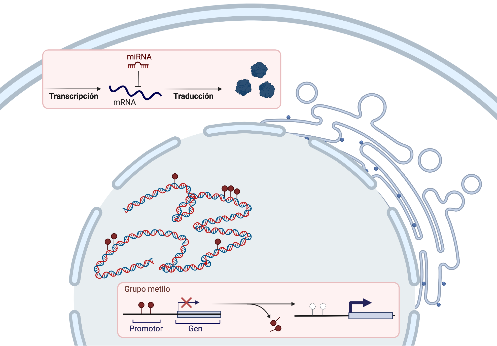
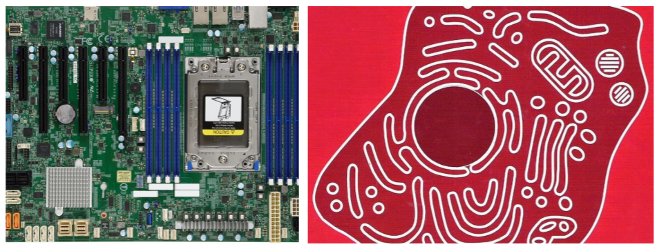
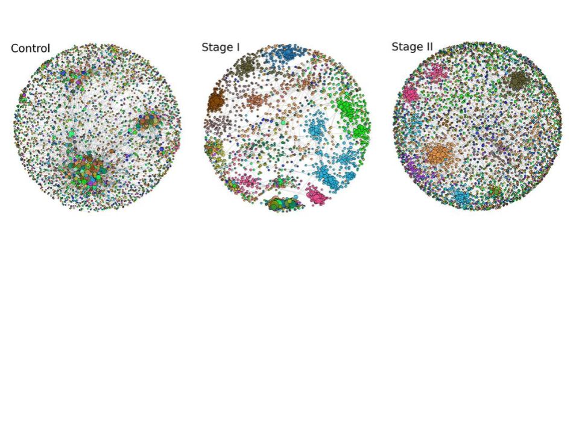
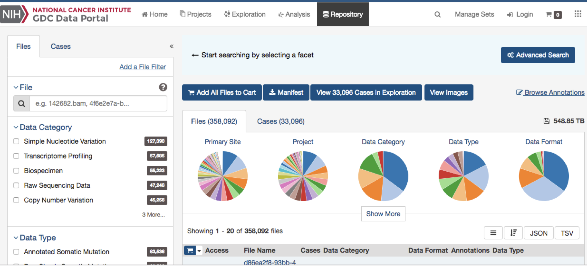

### Tópicos
- Introducción
- Hipótesis
- Objetivo
- Metodología
- Resultados preliminares
- Resumen

### Agradecimientos iniciales
- INCAN - Laboratorio de Cáncer y Virus
- Dr. Alejandro Carranca
- Grupo de Genómica Computacional (INMEGEN)
- Dr. Jesús Espinal Enríquez
- Presentes

### Introducción

### Cáncer

### Progresión del Cáncer

<a target="_blank" href="">[1]</a> Stephen B. Edge, et al. "The American Joint Committee on Cancer: the 7th Edition of the AJCC Cancer Staging Manual and the Future of TNM". Annals of Surgical Oncology 17. 6(2010): 1471–1474.

### Regulación genética y epigenética 

### Fuentes de datos
- TCGA (The Cancer Genome Atlas)
	- 11,300 pacientes 
	- más de 30 tejidos de cáncer.
	- Secuenciación de RNA
		- mRNA 
		- miRNA
	- Secuenciación de 450K sitios CpG

<a target="_blank" href="">[1]</a>The Cancer Genome Atlas Research Network. "Before and After: Comparison of Legacy and Harmonized TCGA Genomic Data Commons Data". Cell Systems. 2019;9(1):24-34.e10.

### Biología de sistemas

### Sistema Complejo

### Planteamiento del problema
La **progresión del cáncer de cervix** es un fenómeno multi-factorial en el que los componentes genéticos y epigenéticos están fuertemente involucrados.
Actualmente, no se sabe con certeza cuál es la **conexión** entre estos dos factores durante la progresión del cáncer.

### Hipótesis
Con nuestra metodología podemos describir los **posibles mecanismos subyacentes** de control regulatorio llevados a cabo por miRNAs y por metilación sobre genes involucrados en la progresión del cáncer de cervix.

### Objetivo
Encontrar **genes clave** que son afectados por **miRNAs** o por **metilación**. Estos genes cambian su programa regulatorio, de expresión y de **co-expresión** durante   la progresión del cáncer de cervix.

### Metodología

### Flujo de trabajo

### Caso de estudio: Carcinomas de Cervix (CC)
- Globalmente, es el cuarto cáncer más frecuentemente diagnosticado en mujeres.
- En etapas avanzadas es uno de los cánceres más letales. 
- La vacunación para HPV mitiga los riesgos de padecer CC. 
- Factores de riesgo: Contagio sexual de HPV. Menos frecuentemente por vía perinatal.
- ¿Cuales son sus características histopatológicas?

<a target="_blank" href="">[2]</a>Ran et al., “Advances in Exosome Biomarkers for Cervical Cancer.”.

### CC - Características Moleculares (1)
- El desarrollo de CC requiere la infección con HPV de linajes altamente carcinogénicos.
- El linaje 16 es la variante de HPV más asociada con CC.
- También están HPV18, HPV45 y HPV31.
- Existen "pocos" biomarcadores de mRNA para diferenciar tejido maligno de no-canceroso.

<a target="_blank" href="">[2]</a>Tsikouras et al., “Cervical Cancer: Screening, Diagnosis and Staging.”

### CC - Características Moleculares (2)
- ¿Marcadores de subtipificación?
- Busqueda de marcadores para las células NK (NKG2D).
- Busqueda de miRNAs asociados a sistema inmune (miR-21 and miR-143).
- Marcadores de metilación que el grupo (INCAN) ya conoce.
- ¿Cómo es la infiltración del sistema inmune en el tumor?.

<a target="_blank" href="">[2]</a>Tsikouras et al., “Cervical Cancer: Screening, Diagnosis and Staging.”

### Muestras de ccRC
| Control | Etapa I  | Etapa II | Etapa III_IV |
|:-------:|:--------:|:--------:|:---------:|
| 3      |  162     |   69     | 66       |

### Omicas harmonizadas

### Concepto de coexpresión

### Construcción inicial

### Construcción de redes de coexpresión

### Resultados

### Coexpresión Gen-Gen (mRNA)

### Redes de coexpresión genética

### Microambiente

<a target="_blank" href="">[1]</a>Yoshihara K, Inferring tumour purity and stromal and immune cell admixture from expression data. Nat Commun. 2013;4(1):2612.

### Trabajo actual y futuro
- Enriquecer las redes que se conservan en las cuatro etapas de CC.
- Encontrar los genes que escalan progresivamente en CC.
- Anotar los miRNAs correctamnte.
- Encontrar los miRNAs que cumplen los filtros en las cuatro etapas de CC.
- Limpiar los perfiles de metilación.
- Encontrar los genes que cambian su perfil de metilación en el promotor.

### ¡Gracias!
- Dr. Jose Maria Zamora Fuentes
- josema.genomics@gmail.com
- https://github.com/josemaz
- ¡Pueden contactarme los estudiantes interesados!

### Apéndice

### Enriquecimiento Biológico

<a target="_blank" href="">[3]</a>Jose Maria Zamora-Fuentes, et al. "Gene Expression and Co-expression Networks Are Strongly Altered Through Stages in Clear Cell Renal Carcinoma". Frontiers in Genetics 11. (2020).

### Expresión en función de la progresión del CRcc

<a target="_blank" href="">[3]</a>Jose Maria Zamora-Fuentes, et al. "Gene Expression and Co-expression Networks Are Strongly Altered Through Stages in Clear Cell Renal Carcinoma". Frontiers in Genetics 11. (2020).

### Regulación genética por microRNAs

### Redes de coexpresión miRNA-gen

### mir217 en las transiciones de ccRC

### mir217 - Modelo

<a target="_blank" href="">[3]</a>Jose Maria Zamora-Fuentes, et al. "miR-217 regulates different oncogenes during clear cell renal carcinoma progression". Frontiers in Genetics (Revisión).

### Regulación genética por Metilación

### Genes afectados por la metilación

### Criterio funcional (Hipometilados)

### Criterio funcional (Hipermetilados)

### Enriquecimiento funcional de las 4 etapas
| Metilación    | Gene núcleo   | Función Biológica  | 
|:------------- |:-------------:| -----:|
|  hypo         | ITK           | Activación de células T |
|  hyper        | RAB25         |   Supresor tumoral      |

### Resumen

### Conclusiones

### Implicaciones (1)
- La identificación de factores genéticos y epigenéticos son resultado de experimentos complejos. Este tipo de métodos computacionales pueden proveer de nuevas hipótesis (ingeniería reversa) con un relativo bajo costo.
- Los resultados in-silico pueden generar evidencia de  biomarcadores con potencial aplicación clínica.

### Implicaciones (2)
- Los resultados de estos experimentos computacionales destacan el impacto del carácter inmunológico del cáncer.
- El programa de expresión en cáncer tiene afectaciones debido a patrones regulares en genes específicos que se amplifican como un sistema biológico complejo.

### Estudiantes interesados
- Skills:
  - Programación en R y Python
  - Manejo de bases de datos SQL
  - Desarrollo de Apps (Javascript)
  - Conceptos básicos de Biología Molecular
  - Conceptos básicos de emfermedades crónico-degenerativas.
- Proyectos
  - Servicio social
  - Titulación Licenciatura y Maestría
  - Estancias en empresas privadas.

### Expresión diferencial (mRNA)

### Expresión Diferencial (miRNA)

### ccRC - CNVS (Amplificaciones)

### mir-217 en Pubmed

### Mutaciones en ccRC

### Cáncer en México

<a target="_blank" href="">Globocan  </a>https://gco.iarc.fr/today

### Aumento de Cáncer de riñon en hombres

### Base de datos TCGA - Tejidos

<a target="_blank" href="">TCGA  </a>https://portal.gdc.cancer.gov/

### Datos de secuenciación TCGA

<a target="_blank" href="">TCGA  </a>https://portal.gdc.cancer.gov/

### Método de selección de genes metilados

### Biogénesis de miRNAs (canónica)

<a target="_blank" href="">Biorender  </a>https://biorender.com/

### Artículos publicados
1. Gene Expression and Co-expression Networks Are Strongly Altered Through Stages in Clear Cell Renal Carcinoma. (F. Genetics, 2020)
2. Gene co-expression in breast cancer: a matter of distance. (F. Oncology, 2021)
3. Loss of long distance co-expression in lung cancer (F. Genetics, 2021)
4. Oncogenic Role of miR-217 During Clear Cell Renal Carcinoma Progression. (F. Oncology, 2022)
5. Methylation-related genes involved in renal carcinoma progression  (F. Genetics, 2023)

### Colaboraciones actuales
- Dr. Alejandro Carranca (INCAN)
- Dra. Patricia García (INCAN)
- Dra. María Gloria Soldevila (IIBO-UNAM)
- Dr. Felipe Vadillo Ortega (INMEGEN)

### Agradecimientos
- A mis compañeros de grupo
- A mi tutor
- A mi comité tutoral
- A mis profesores 
- CONACYT (cvu 267236)
- UNAM, IE e INMEGEN
