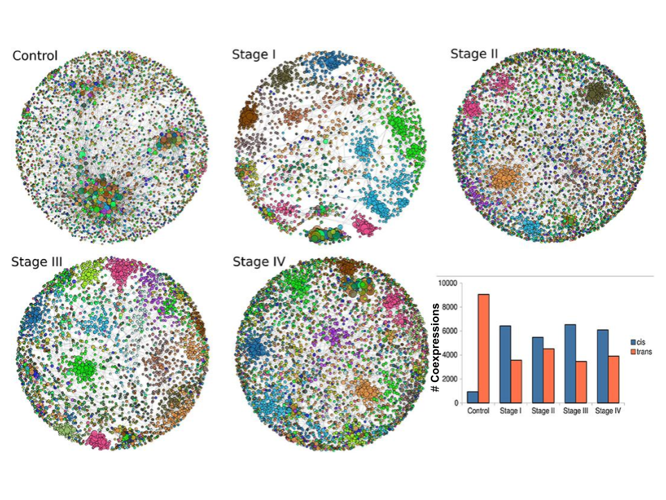
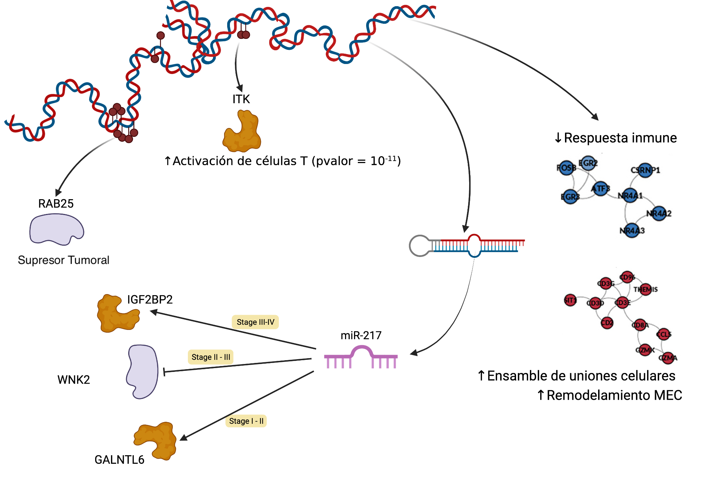
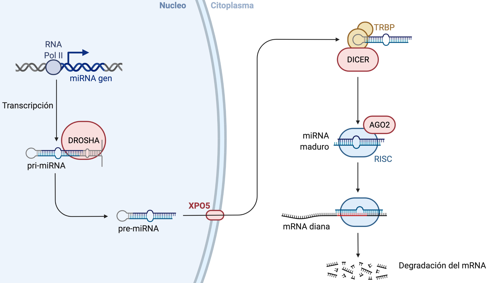

### Introducción

### Cáncer

### Progresión del Cáncer

<a target="_blank" href="">[1]</a> Stephen B. Edge, et al. "The American Joint Committee on Cancer: the 7th Edition of the AJCC Cancer Staging Manual and the Future of TNM". Annals of Surgical Oncology 17. 6(2010): 1471–1474.

### Regulación genética y epigenética 

### Fuentes de datos
- TCGA (The Cancer Genome Atlas)
	- 11,300 pacientes 
	- más de 30 tejidos de cáncer.
	- Secuenciación de RNA
		- mRNA 
		- miRNA
	- Secuenciación de 450K sitios CpG

<a target="_blank" href="">[1]</a>The Cancer Genome Atlas Research Network. "Before and After: Comparison of Legacy and Harmonized TCGA Genomic Data Commons Data". Cell Systems. 2019;9(1):24-34.e10.

<aside class="notes">
Que es un experimento RNAseq?
Que es un experimento de miRNAs?
Como se hace la secuención de sitios CpG?
</aside>

### Biología de sistemas

### Sistema Complejo

### Objetivo
Encontrar **genes clave** que son afectados por **miRNAs** o por **metilación**. Estos genes cambian su programa regulatorio, de expresión y de **co-expresión** durante   la progresión del cáncer.

### Metodología

### Caso de estudio: Carcinoma Renal
- Cáncer "silencioso" (ausencia de síntomas).
- 80% de los casos se diagnostican de manera incidental en imágenes solicitadas por otros motivos,
- de estos casos, el 20% son diagnosticados en etapas avanzadas,
- en este porcentaje la tasa de mortalidad es del 95% a los 5 años.
- Factores de riesgo:  fumar, hipertensión, obesidad, diabetes.

<a target="_blank" href="">[2]</a>James J. Hsieh, et al. "Renal cell carcinoma". Nature Reviews Disease Primers 3. 1(2017).

### CRcc - Características Moleculares
- 85% se encuentran en células claras.
- Línea principal:  Mutaciones en VHL.
- Pérdida en VHL no induce CRcc.
- Biomarcadores de metilación no especificados.
- Histopatalogía con alta degradación de MEC (regado de estroma)

<a target="_blank" href="">[2]</a>James J. Hsieh, et al. "Renal cell carcinoma". Nature Reviews Disease Primers 3. 1(2017).

### Construcción inicial

### Construcción de redes de coexpresión

### Resultados

### Coexpresión Gen-Gen (mRNA)

### Redes de coexpresión genética

<a target="_blank" href="">[3]</a>Jose Maria Zamora-Fuentes, et al. "Gene Expression and Co-expression Networks Are Strongly Altered Through Stages in Clear Cell Renal Carcinoma". Frontiers in Genetics 11. (2020).

### Conclusiones

### Implicaciones (1)
- La identificación de factores genéticos y epigenéticos son resultado de experimentos complejos. Este tipo de métodos computacionales pueden proveer de nuevas hipótesis (ingeniería reversa) con un relativo bajo costo.
- Los resultados in-silico pueden geneerar evidencia de  biomarcadores con potencial aplicación clínica.

### Implicaciones (2)
- Los resultados de estos experimentos computacionales destacan el impacto del carácter inmunológico del cáncer.
- El programa de expresión en cáncer tiene afectaciones debido a patrones regulares en genes específicos que se amplifican como un sistema biológico complejo.

### Trabajo futuro
- Usar esta metodología para evaluar los siguientes tejidos de cáncer.
- Explorar las diferencias en los genes para la metilación.
- Validar experimentalmente los resultados.
    - Experimentos usando sc-RNAseq
- Explorar otras bases de datos (GEO, ENCODE, etc)

### Artículos publicados
1. Gene Expression and Co-expression Networks Are Strongly Altered Through Stages in Clear Cell Renal Carcinoma. (F. Genetics, 2020)
2. Gene co-expression in breast cancer: a matter of distance. (F. Oncology, 2021)
3. Loss of long distance co-expression in lung cancer (F. Genetics, 2021)
4. Oncogenic Role of miR-217 During Clear Cell Renal Carcinoma Progression. (F. Oncology, 2022)
5. Methylation-related genes involved in renal carcinoma progression  (F. Genetics, 2023)

### ¡Gracias!
- Dr. Jose Maria Zamora Fuentes
- josema.genomics@gmail.com
- ¡Pueden contactarme los estudiantes interesados!

### Apendice

### Estudiantes interesados
- Skills:
  - Programación en R y Python
  - Manejo de bases de datos SQL
  - Desarrollo de Apps (Javascript)
  - Conceptos básicos de Biología Molecular
  - Conceptos básicos de emfermedades crónico-degenerativas.
- Proyectos
  - Servicio social
  - Titulación Licenciatura y Maestría
  - Estancias en empresas privadas.

### Modelo de trabajo
- Vieja escuela
- Iniciativa privada (Emprendimiento de Negocios)
- Desarrollo Personal
- Aprendizaje estoico de la Ciencia y la Programación (Computación)
- ¡Los experimentales han muerto!

### El mundo real
- Comer
- La salud
- Inversión y sacrificio
- Generar gananacias
- ¡En el mundo real los leones se comen a las zebras!

### Proyectos en Ciencia de Datos
- Sistemas anticorrupción en el Gobierno
- Relación en los mercados farmaceúticos y política econonómica
- Procesamiento del Lenguage Natural en la Jurisprudencia
- Análisis de Sentimientos en Twitter
- Cancer, Diabetes, VPH, Sindromes
- Dietas alimenticias (Veganismo, vegetarianismo, etc)
- Reconocimiento de imagenes histopatológicas
- Análisis de mercados financieros, etc.
 

### Microambiente

<a target="_blank" href="">[1]</a>Yoshihara K, Inferring tumour purity and stromal and immune cell admixture from expression data. Nat Commun. 2013;4(1):2612.

### Biogénesis de miRNAs (canónica)

<a target="_blank" href="">Biorender  </a>https://biorender.com/

