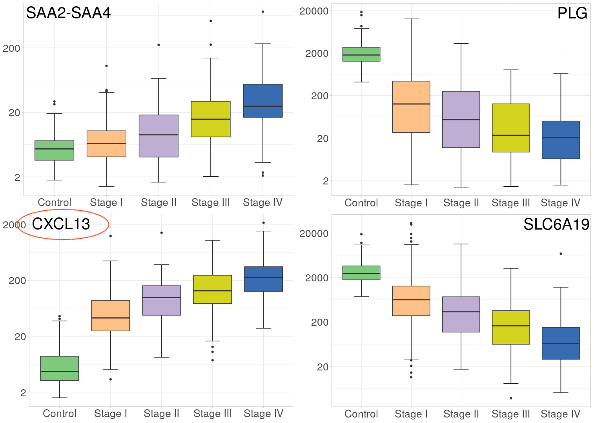
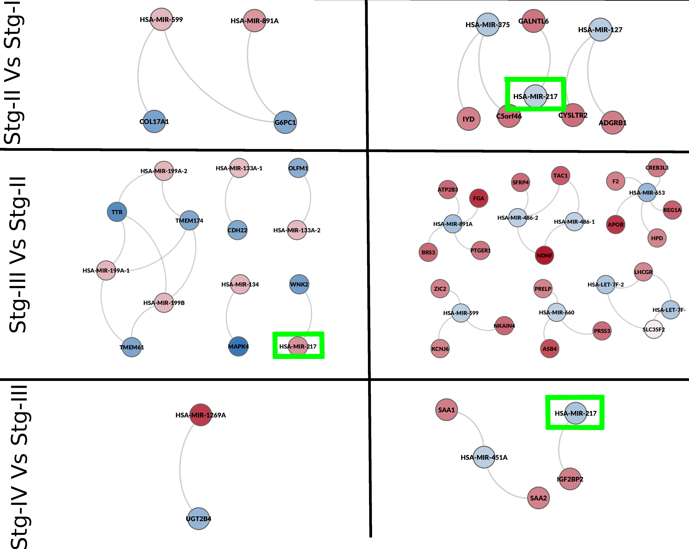
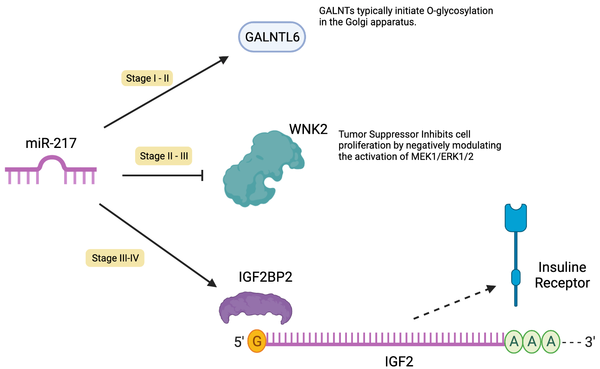
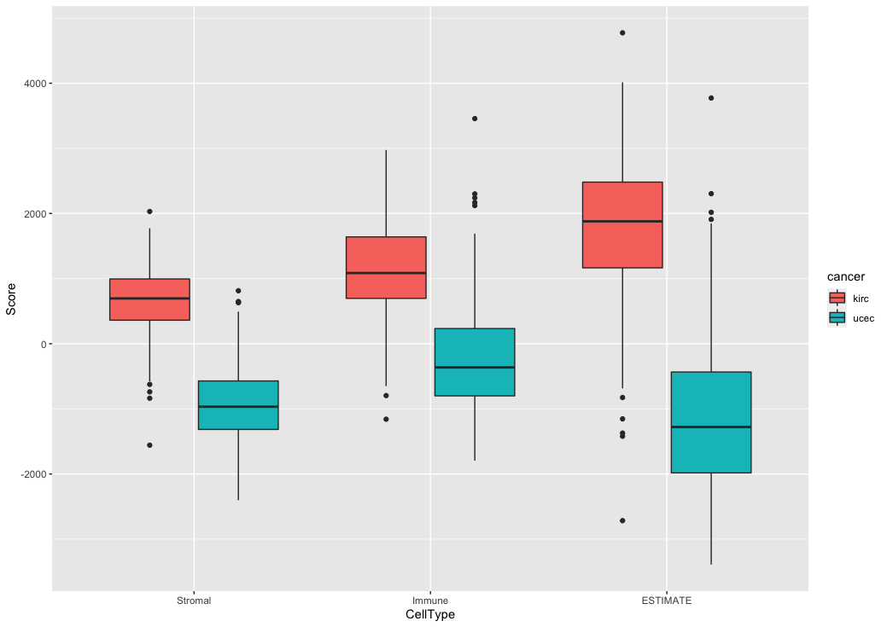
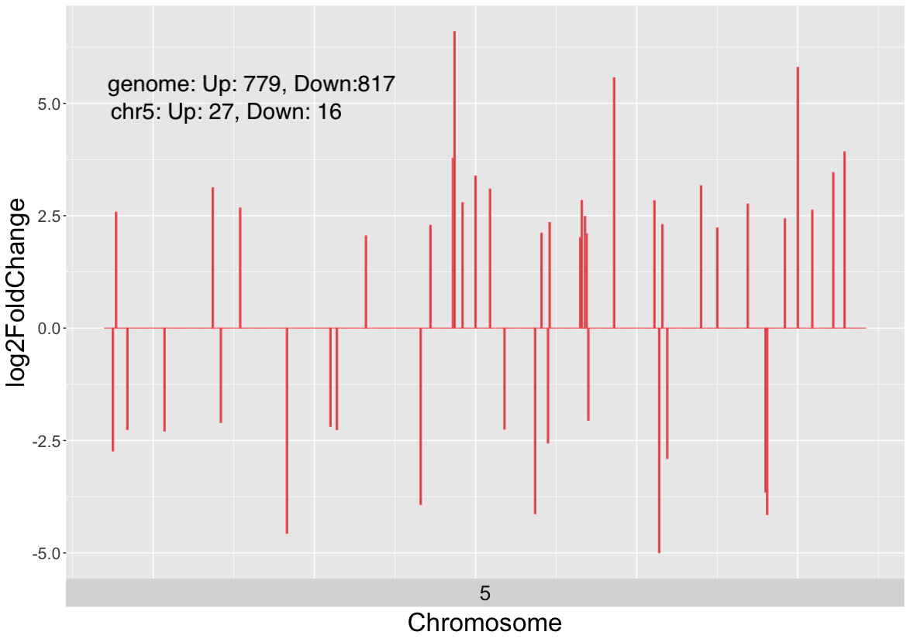
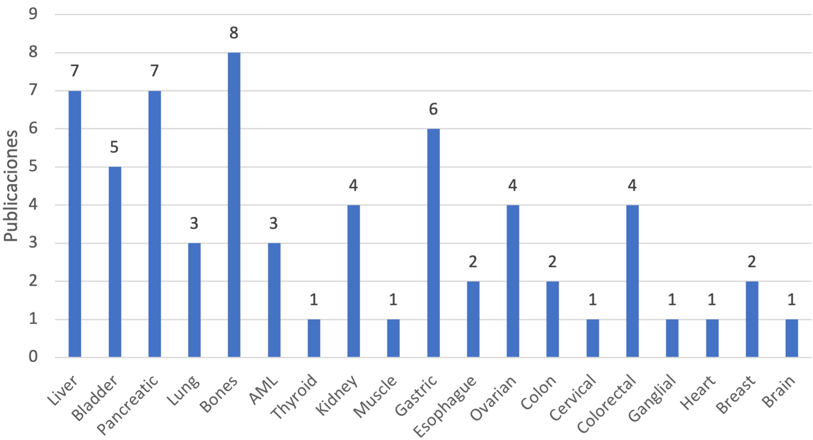

### Tópicos
- Introducción
- Hipótesis
- Objetivo
- Metodología
- Resultados
- Resumen

### Agradecimientos iniciales
- Jurado
	- Dr. Felix Recillas Targa
	- Dra. Lorena Aguilar Arnal
	- Dr. Alejandro García Carranca
	- Dra. Patricia López 
- Tutor
	- Dr. Jesus Espinal Enriquez
- Presentes

### Descripción
Breve descripción del trabajo en el tiempo.

### Introducción

### Cáncer

### Progresión del Cáncer

<a target="_blank" href="">[1]</a> Stephen B. Edge, et al. "The American Joint Committee on Cancer: the 7th Edition of the AJCC Cancer Staging Manual and the Future of TNM". Annals of Surgical Oncology 17. 6(2010): 1471–1474.

### Regulación genética y epigenética 

### Fuentes de datos
- TCGA (The Cancer Genome Atlas)
	- 11,300 pacientes 
	- más de 30 tejidos de cáncer.
	- Secuenciación de RNA
		- mRNA 
		- miRNA
	- Secuenciación de 450K sitios CpG

<a target="_blank" href="">[1]</a>The Cancer Genome Atlas Research Network. "Before and After: Comparison of Legacy and Harmonized TCGA Genomic Data Commons Data". Cell Systems. 2019;9(1):24-34.e10.

<aside class="notes">
Que es un experimento RNAseq?
Que es un experimento de miRNAs?
Como se hace la secuención de sitios CpG?
</aside>

### Biología de sistemas

### Planteamiento del problema
La **progresión del cáncer** es un fenómeno multi-factorial en el que los componentes genéticos y epigenéticos están fuertemente involucrados.
Actualmente, no se sabe con certeza cuál es la **conexión** entre estos dos factores durante la progresión del cáncer.

### Hipótesis
Con nuestra metodología podemos describir los **posibles mecanismos subyacentes** de control regulatorio llevados a cabo por miRNAs y por metilación sobre genes involucrados en la progresión del cáncer.

### Objetivo
Encontrar **genes clave** que son afectados por **miRNAs** o por **metilación**. Estos genes cambian su programa regulatorio, de expresión y de **co-expresión** durante   la progresión del cáncer.

### Metodología

### Flujo de trabajo

### Caso de estudio: Carcinoma Renal
- Cáncer "silencioso" (ausencia de síntomas).
- 80% de los casos se diagnostican de manera incidental en imágenes solicitadas por otros motivos,
- de estos casos, el 20% son diagnosticados en etapas avanzadas,
- en este porcentaje la tasa de mortalidad es del 95% a los 5 años.
- Factores de riesgo:  fumar, hipertensión, obesidad, diabetes.

<a target="_blank" href="">[2]</a>James J. Hsieh, et al. "Renal cell carcinoma". Nature Reviews Disease Primers 3. 1(2017).

### CRcc - Características Moleculares
- 85% se encuentran en células claras.
- Línea principal:  Mutaciones en VHL.
- Pérdida en VHL no induce ccRC.
- Biomarcadores de metilación no especificados.
- Histopatalogía con alta degradación de MEC (regado de estroma)

<a target="_blank" href="">[2]</a>James J. Hsieh, et al. "Renal cell carcinoma". Nature Reviews Disease Primers 3. 1(2017).

### Muestras de ccRC
| Control | Etapa I  | Etapa II | Etapa III | Etapa IV |
|:-------:|:--------:|:--------:|:---------:|:--------:|
|  72     |  272     |   59     | 123       | 82       |

### Concepto de coexpresión

### Construcción inicial

### Construcción de redes de coexpresión

### Resultados

### Coexpresión Gen-Gen (mRNA)

### Expresión en función de la progresión del CRcc

<a target="_blank" href="">[3]</a>Jose Maria Zamora-Fuentes, et al. "Gene Expression and Co-expression Networks Are Strongly Altered Through Stages in Clear Cell Renal Carcinoma". Frontiers in Genetics 11. (2020).

### Redes de coexpresión genética

<a target="_blank" href="">[3]</a>Jose Maria Zamora-Fuentes, et al. "Gene Expression and Co-expression Networks Are Strongly Altered Through Stages in Clear Cell Renal Carcinoma". Frontiers in Genetics 11. (2020).

### Enriquecimiento Biológico

<a target="_blank" href="">[3]</a>Jose Maria Zamora-Fuentes, et al. "Gene Expression and Co-expression Networks Are Strongly Altered Through Stages in Clear Cell Renal Carcinoma". Frontiers in Genetics 11. (2020).

### Regulación genética por microRNAs

### Redes de coexpresión miRNA-gen

### mir217 en las transiciones de ccRC

### mir217 - Modelo

<a target="_blank" href="">[3]</a>Jose Maria Zamora-Fuentes, et al. "miR-217 regulates different oncogenes during clear cell renal carcinoma progression". Frontiers in Genetics (Revisión).

### Regulación genética por Metilación

### Genes afectados por la metilación

### Criterio funcional (Hipometilados)

### Criterio funcional (Hipermetilados)

### Enriquecimiento funcional de las 4 etapas
| Metilación    | Gene núcleo   | Función Biológica  | 
|:------------- |:-------------:| -----:|
|  hypo         | ITK           | Activación de células T |
|  hyper        | RAB25         |   Supresor tumoral      |

### Resumen

### Conclusiones

### Implicaciones
- La identificación de factores genéticos y epigenéticos que son resultado de experimentos complejos, pueden proveer de nuevas hipótesis con este tipo de métodos computacionales (ingeniería reversa).
- Los resultados in-silico nos pueden proveer de evidencia para  biomarcadores con potencial aplicación clínica.
- Los resultados de estos experimentos computacionales destacan el impacto del caracter inmunológico del cáncer.
- El programa de expresión en cáncer tiene afectaciones debido a patrones regulares en genes particulares que se amplifican como un sistema biológico complejo.

### Trabajo futuro
- Usar esta metodología para evaluar los siguientes tejidos de cáncer.
- Explorar las diferencias en los genes para la metilación.
- Validar experimentalmente los resultados.
    - Experimentos usando sc-RNAseq
- Explorar otras bases de datos (GEO, ENCODE, etc)

### Agradecimientos
- Comité tutoral.
- Comité (exámen de candidatura)
- CONACYT (cvu 267236)
- UNAM, IE e INMEGEN

### Artículos publicados
- Gene Expression and Co-expression Networks Are Strongly Altered Through Stages in Clear Cell Renal Carcinoma. (F. Genetics, 2020)
- Gene co-expression in breast cancer: a matter of distance. (F. Oncology, 2021)
- Loss of long distance co-expression in lung cancer (F. Genetics, 2021)
- Oncogenic Role of miR-217 During Clear Cell Renal Carcinoma Progression. (F. Oncology, 2022)
- Methylation-related genes involved in renal carcinoma progression  (F. Genetics, 2023)

### Apendice

### Expresión diferencial (mRNA)

### Expresión Diferencial (miRNA)

### Microambiente

<a target="_blank" href="">[1]</a>Yoshihara K, Inferring tumour purity and stromal and immune cell admixture from expression data. Nat Commun. 2013;4(1):2612.

### ccRC - CNVS (Amplificaciones)

### mir-217 en Pubmed

### Mutaciones en ccRC

### Cáncer en México

<a target="_blank" href="">Globocan  </a>https://gco.iarc.fr/today

### Aumento de Cáncer de riñon en hombres

### Base de datos TCGA - Tejidos

<a target="_blank" href="">TCGA  </a>https://portal.gdc.cancer.gov/

### Datos de secuenciación TCGA

<a target="_blank" href="">TCGA  </a>https://portal.gdc.cancer.gov/

### Método de selección de genes metilados

### Biogénesis de miRNAs (canónica)

<a target="_blank" href="">Biorender  </a>https://biorender.com/

